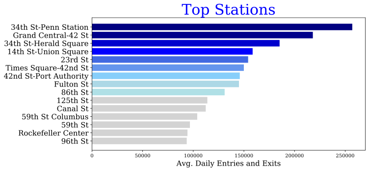

# Exploritory Data Analysis of NYC Subway Usage

**Problem:** The premise of this project was to help a fictitious non-profit optimize it's placement of canvasing teams around subway stations in Manhattan. The non-profit was planning to have a fundraising gala and wanted to increase it's exposure by getting emails of those interesting in it's mission.   

To complish the goal, I decided to focus on maximizing exposure and email address collection. Increasing expoure was a critical component of increasing the attandence of the fundraising gala,  In my experience with canvessing, the vast majority of people will walk by, so we would want to find the location with the greatest flow of people. 

I set out to find the subway stations that had the greatest flow of people. 

**Data:** I used the MTA website and downloaded records of turnstile usage to find the stations with the most traffic. The data was in CSVs, which I loaded into a Pandas DataFrame. The data needed to be cleaned and processed. The entries of the data weren't counts of people but individual turnstile transactions. 

**Model:** Answering the question of which station require some EDA. Nothing too sophisticated, but the data needed to be processed. 

**Results:** I was able to find the most trafficed stations. 

